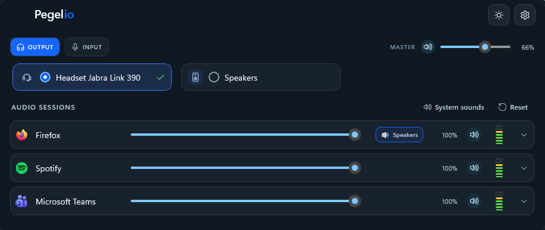
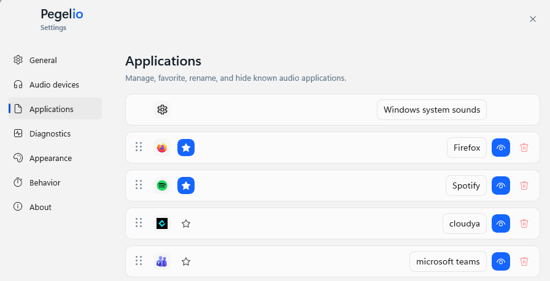

# Pegelio

**Pegelio is a native Windows 11 audio control application for fast access to output devices, application volume, microphones and per-app audio routing.**

Pegelio is currently under active development and available as an early alpha release.

## Screenshots

### Audio control

Switch output devices, control application volume and route individual applications to different audio devices.

### Quick access

Control master volume and active applications directly from the compact top bar.

### Application management

Manage known applications, favorites, visibility and custom application settings.

## What Pegelio does

* Switch the Windows default audio output device
* Control volume and mute per application
* Display active audio applications
* Keep selected applications visible as favorites
* Route individual applications to different output devices
* Select and control microphones
* Provide an auto-reveal interface at the top of the screen
* Support light and dark mode
* Support German and English
* Provide integrated audio diagnostics

## Download

The latest test version is available from the GitHub Releases section of this repository.

Current version:

`0.7.0-alpha.1`

## System requirements

* Windows 11
* 64-bit Windows installation
* x64-compatible processor

## Alpha notice

Pegelio is currently an early alpha version.

Bugs, crashes, device compatibility issues and incomplete behavior are possible. Do not rely on Pegelio for critical audio workflows.

The current installer is not digitally signed. Windows SmartScreen may therefore display an unknown publisher warning.

## Privacy

Pegelio processes Windows audio-device and audio-session information locally on the computer.

Pegelio does not record audio and does not require a user account.

## Feedback

Feedback is especially useful for:

* Bluetooth and USB audio devices
* Multiple playback devices
* Per-app audio routing
* Application and device detection
* Display scaling at 125%, 150% or higher
* Multiple monitors
* Startup and auto-reveal behavior
* Crashes or disappearing settings

For technical issues, use the Issues section of this repository.

When reporting a problem, include:

* Windows version
* Pegelio version
* Display resolution and scaling
* Audio devices involved
* Application involved
* Exact steps to reproduce the problem

## Source code

This repository contains public releases and documentation only.

The Pegelio source-code repository is currently private.
