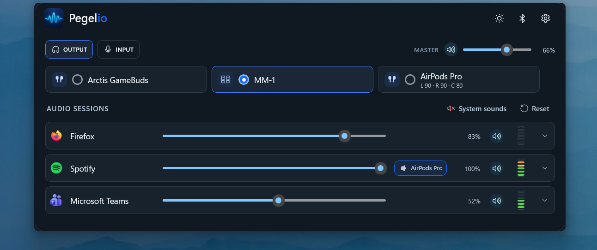
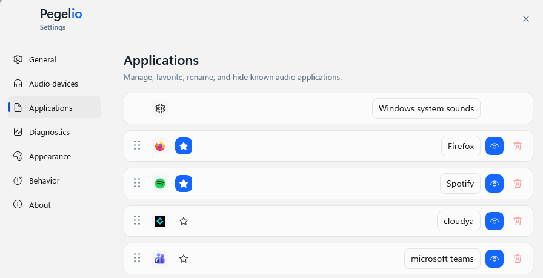

# Pegelio

**Pegelio is a native Windows 11 audio controller that puts your most important audio controls directly at the top of the screen.**

Switch output devices, control application volumes, manage microphones and route individual applications to different audio devices—without repeatedly opening the Windows sound settings.

Pegelio is currently under active development and available as an early alpha release.

## Screenshots

### Audio control

Switch between speakers, headphones and other output devices, control individual application volumes and route applications to different audio devices.

### Quick access

Control master volume and active applications directly from the compact top bar.

Move the mouse to the top edge of the screen to reveal Pegelio without interrupting your current workflow.

### Application management

Manage known applications, favorites, visibility, display names and custom application icons.

## Features

### Fast audio access

* Auto-reveal interface at the top of the screen
* Compact quick-access bar for master volume and active applications
* Configurable reveal and hide delay
* System tray access
* Optional startup with Windows

### Output devices

* Switch the Windows default output device
* Quickly select speakers, headphones, headsets and other audio devices
* Favorite frequently used devices
* Hide irrelevant or virtual audio devices
* Connect and manage supported Bluetooth devices
* Display available battery information for supported Bluetooth headphones and AirPods

### Applications and routing

* Control volume and mute per application
* Display currently active audio applications
* Keep selected applications visible as favorites
* Route individual applications to different output devices
* Reset individual or all application routing assignments
* Customize application names, visibility and icons

For example, Spotify can play through speakers while Firefox or a communication application uses headphones.

### Microphones

* View and select the Windows default microphone
* Control microphone volume and mute
* Display microphone input levels
* Improve handling of Bluetooth headset playback and microphone profiles

### Multi-monitor support

* Use Pegelio across multiple monitors
* Open the interface on the monitor currently in use
* Handle different monitor resolutions and display scaling settings

### Additional features

* Integrated audio diagnostics
* Light, dark and system theme
* German and English interface
* Fullscreen protection
* Support for display scaling at 125%, 150% and higher

## Recent improvements

The latest alpha includes:

* Improved Bluetooth-headset handling
* AirPods battery display
* Multi-monitor support
* Configurable auto-reveal delay
* More reliable tray and auto-hide behavior
* Improved handling of parallel settings access
* Numerous stability fixes for audio devices, Bluetooth and application sessions

## Download

The latest test version is available from the GitHub Releases section of this repository.

**Current version:**  
[0.7.1-alpha.8](https://github.com/endi8bar/pegelio-releases/releases/tag/v0.7.1-alpha.8)

**Installer:**  
`Pegelio-Setup-0.7.1-alpha.8.exe`

## System requirements

* Windows 11
* 64-bit Windows installation
* x64-compatible processor

## Alpha notice

Pegelio is currently an early alpha version.

Bugs, crashes, device compatibility issues and incomplete behavior are still possible. Do not rely on Pegelio for critical audio workflows.

The current installer is not digitally signed. Windows SmartScreen may therefore display an unknown publisher warning.

## Privacy

Pegelio processes Windows audio-device, Bluetooth-device and audio-session information locally on the computer.

Pegelio does not record audio, upload audio content or require a user account.

## Feedback

Testing and feedback are especially useful for:

* Bluetooth and USB audio devices
* AirPods and other Bluetooth headphones
* Multiple playback and recording devices
* Per-application audio routing
* Application and device detection
* Display scaling at 125%, 150% or higher
* Multiple-monitor configurations
* Startup, tray and auto-reveal behavior
* Crashes, freezes or disappearing settings

Use the GitHub Issues section to submit a structured bug report or general feedback.

When reporting a problem, include:

* Windows version
* Pegelio version
* Display resolution and scaling
* Number and arrangement of monitors
* Audio devices involved
* Application involved
* Exact steps required to reproduce the problem

Diagnostic logs generated by Pegelio can also help identify device, routing and startup problems.

## Source code

This repository contains public releases and documentation only.

The Pegelio source-code repository is currently private.
